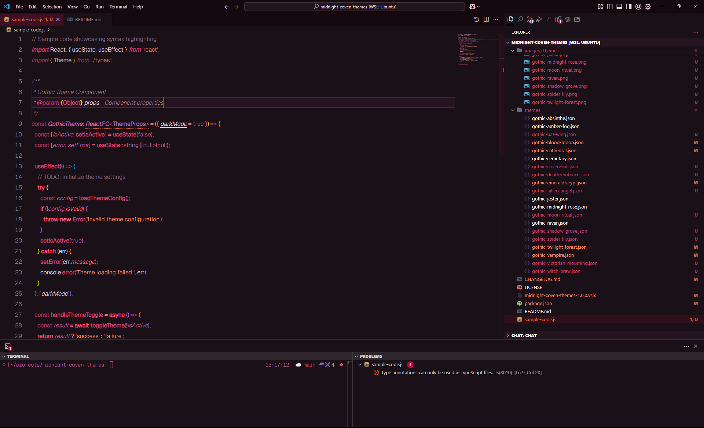
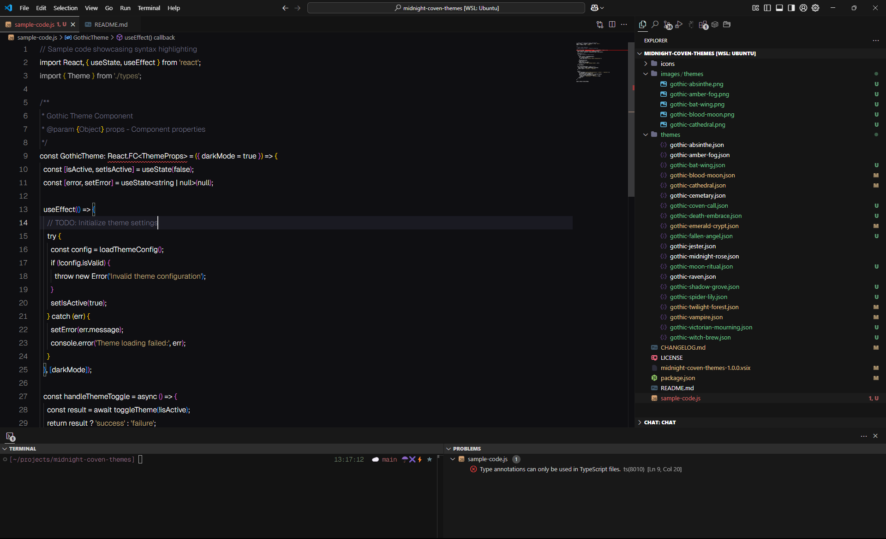
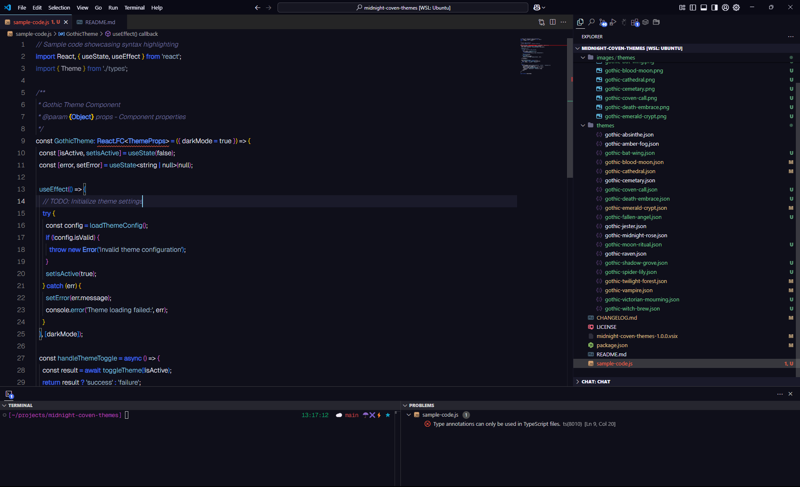
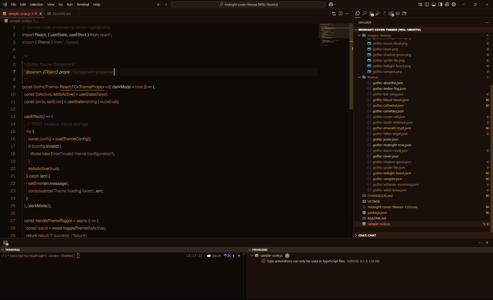

# Midnight Coven: Gothic Theme Collection

A comprehensive collection of 21 dark, gothic-inspired color themes for Visual Studio Code. Perfect for nocturnal coders who appreciate dark aesthetics and atmospheric coding environments.

## 🎨 Theme Gallery


Explore our collection of 21 atmospheric gothic themes:

### Featured Themes

| Gothic Cathedral | Gothic Vampire | Gothic Emerald Crypt |
|:---:|:---:|:---:|
|  |  |  |
| *Inspired by stained glass and gothic architecture* | *Deep crimson and blood-red accents* | *Rich emerald greens with mystical accents* |

| Gothic Midnight Rose | Gothic Twilight Forest | Gothic Blood Moon |
|:---:|:---:|:---:|
|  |  |  |
| *Deep purples and magentas with rose highlights* | *Forest greens with mysterious twilight blues* | *Dark reds and oranges evoking lunar eclipses* |

<details>
<summary><strong>📖 View All 21 Themes</strong></summary>

### Complete Collection

| Theme | Preview | Description |
|-------|:-------:|-------------|
| **Gothic Cathedral** |  | Inspired by stained glass and gothic architecture |
| **Gothic Cemetery** |  | Cool, misty tones of foggy graveyards |
| **Gothic Vampire** |  | Deep crimson and blood-red accents (enhanced error visibility) |
| **Gothic Jester** |  | Vibrant yet dark medieval court inspiration |
| **Gothic Absinthe** |  | Mysterious green tones with ethereal highlights |
| **Gothic Raven** |  | Deep blacks with subtle purple undertones |
| **Gothic Blood Moon** |  | Dark reds and oranges evoking lunar eclipses (enhanced error visibility) |
| **Gothic Emerald Crypt** |  | Rich emerald greens with mystical accents |
| **Gothic Midnight Rose** |  | Deep purples and magentas with rose highlights |
| **Gothic Amber Fog** |  | Warm amber and gold tones through misty grays |
| **Gothic Twilight Forest** |  | Forest greens with mysterious twilight blues |
| **Gothic Bat Wing** |  | Deep purples and blues with nocturnal atmosphere |
| **Gothic Death's Embrace** |  | Monochromatic grays with subtle contrasts |
| **Gothic Fallen Angel** |  | Celestial blues with divine inspiration |
| **Gothic Witch's Brew** |  | Earthy greens with magical undertones |
| **Gothic Moon Ritual** |  | Mystical purples with lunar aesthetics |
| **Gothic Coven's Call** |  | Rich magentas for mysterious gatherings |
| **Gothic Shadow Grove** |  | Dark forest greens with whispered shadows |
| **Gothic Victorian Mourning** |  | Elegant purples with period sophistication |
| **Gothic Spider Lily** |  | Romantic reds and pinks with floral elegance |
| **Gothic Qaddy** |  | Dark+ inspired theme with off-white foreground and dark beige comments |

</details>

## 🎨 Color Themes

This extension includes 21 carefully crafted gothic themes, each with its own unique atmosphere:

- **Gothic Cathedral** - Inspired by stained glass and gothic architecture
- **Gothic Cemetery** - Cool, misty tones of foggy graveyards
- **Gothic Vampire** - Deep crimson and blood-red accents (enhanced error visibility)
- **Gothic Jester** - Vibrant yet dark medieval court inspiration
- **Gothic Absinthe** - Mysterious green tones with ethereal highlights
- **Gothic Raven** - Deep blacks with subtle purple undertones
- **Gothic Blood Moon** - Dark reds and oranges evoking lunar eclipses (enhanced error visibility)
- **Gothic Emerald Crypt** - Rich emerald greens with mystical accents
- **Gothic Midnight Rose** - Deep purples and magentas with rose highlights
- **Gothic Amber Fog** - Warm amber and gold tones through misty grays
- **Gothic Twilight Forest** - Forest greens with mysterious twilight blues
- **Gothic Bat Wing** - Deep purples and blues with nocturnal atmosphere
- **Gothic Death's Embrace** - Monochromatic grays with subtle contrasts
- **Gothic Fallen Angel** - Celestial blues with divine inspiration
- **Gothic Witch's Brew** - Earthy greens with magical undertones
- **Gothic Moon Ritual** - Mystical purples with lunar aesthetics
- **Gothic Coven's Call** - Rich magentas for mysterious gatherings
- **Gothic Shadow Grove** - Dark forest greens with whispered shadows
- **Gothic Victorian Mourning** - Elegant purples with period sophistication
- **Gothic Spider Lily** - Romantic reds and pinks with floral elegance
- **Gothic Qaddy** - Dark+ inspired theme with off-white foreground and dark beige comments

## 🚀 Planned Features

- **🎯 Gothic File Icons**: Custom pixel art icons for files and folders are coming soon! These will feature gothic-styled designs that perfectly complement the dark themes.

## ✨ Features

- **21 Unique Themes**: Each theme creates a distinctive gothic atmosphere
- **Rich Color Palettes**: Carefully selected colors that enhance readability while maintaining gothic aesthetics
- **Semantic Highlighting**: Intelligent syntax highlighting that makes code structure clear
- **Complete UI Theming**: Consistent styling across all VS Code interface elements
- **Enhanced Readability**: High contrast variants ensure accessibility for all users


## 🔧 Recommended Settings

For the best experience, consider these VS Code settings:

```json
{
  "editor.fontSize": 14,
  "editor.lineHeight": 1.6,
  "editor.fontWeight": "400",
  "editor.cursorBlinking": "phase",
  "editor.cursorSmoothCaretAnimation": "on",
  "workbench.tree.indent": 20,
  "editor.semanticHighlighting.enabled": true
}
```

## 🤝 Contributing

Found a bug or have suggestions? Contributions are welcome!

- **Issues**: Report bugs or request features on our [GitHub repository](https://github.com/diyllan/midnight-coven-themes)
- **Pull Requests**: Improvements to themes are appreciated

## 📄 License

This extension is licensed under the MIT License. See [LICENSE](LICENSE) for details.

## 🌙 Enjoy Your Gothic Coding Experience!

Transform your development environment into a mysterious, atmospheric workspace that inspires creativity and focus during those late-night coding sessions.

---

*"In the shadows of code, beauty dwells..."*
